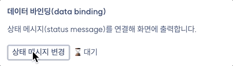
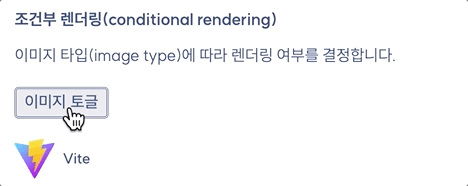
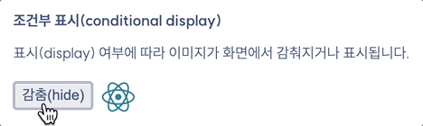
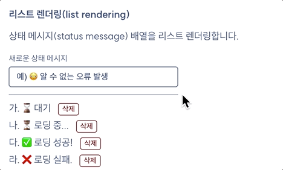
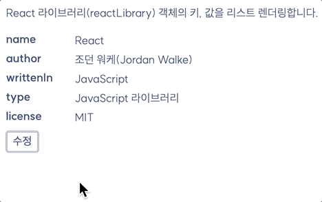

# React 상태(State)

React 컴포넌트의 상태를 관리하는 방법과 리-렌더링 조건에 대해 학습합니다.

- [ ] useState 훅
  - [ ] 상태 (불변 데이터)
  - [ ] 상태 업데이트 함수
  - [ ] 리-렌더링 (이벤트 핸들링)

## 구현 사항

### 1. 랜덤 상태 메시지 변경

"상태 메시지 변경" 버튼을 추가한 다음 클릭 시, 랜덤으로 상태 메시지가 변경되도록 구현합니다.

### 2. 이미지 렌더링 토글

"이미지 토글" 버튼을 추가한 후 클릭할 때마다 이미지가 토글되도록 구현합니다.

### 3. 표시/감춤 상태 토글

"표시/감춤" 버튼을 추가한 다음 클릭할 때마다 이미지가 화면에 표시되거나 감춰지도록 구현합니다.

### 4. 상태 메시지 추가/삭제

"새로운 상태 메시지" 입력 필드를 추가한 뒤, 사용자가 입력하면 상태 메시지 목록이 업데이트 되도록 구현하고, 각 항목의 "삭제" 버튼을 클릭하면 해당 항목이 삭제되도록 구현합니다.

### 5. 콘텐츠 업데이트

"수정" 버튼을 추가한 다음 버튼을 누르면 콘텐츠 수정 폼이 화면에 렌더링 되도록 구현합니다.
콘텐츠를 수정한 후, "저장" 버튼을 누르면 업데이트 된 콘테츠로 업데이트 되어야 합니다.

